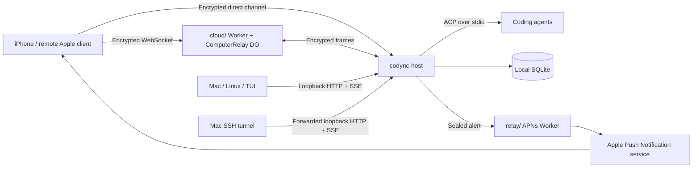

# Architecture

Codync keeps agents and their working files on a computer. Clients address that computer's bots; the host owns execution, transcripts and authorization.

## Runtime paths

The phone tries direct candidates first, with a 1.5-second connection race, then uses the configured cloud relay. Both paths use the same end-to-end encrypted channel. Tailscale is an optional direct route. Loopback bearer credentials are for local applications and SSH forwarding, not phone pairing.

## Ownership and storage

| Data | Owner and location |
|---|---|
| Bots, chats, replies, revisions, authorized devices | Host SQLite in its data directory (`~/.codync` by default; `CODYNC_HOME` overrides it) |
| Host signing and mailbox keys | `identity.json`, separate from SQLite |
| Loopback API bearer token | Host `token` file |
| Agent context and provider credentials | Coding harness on that computer |
| Long-term bot memory | Host `bots/<botId>/memory/` |
| Account users, computer ownership, devices and grants | `cloud/` D1 |
| Presence, host-signed ACL, offline encrypted mailbox | Per-computer `ComputerRelay` Durable Object |
| Phone/Mac remote-device signing and push keys | Keychain, partitioned by account context |
| Client mirror, widget snapshots, selected computer | Per-account cache/App Group storage |
| APNs signing key and ticket encryption key | `relay/` Worker secrets |

Cloud account metadata includes names, public keys, ownership and access state. Chat/channel contents and notification title/body are encrypted. Routing IDs, timing and sizes remain visible to the relevant service; “end-to-end encrypted” does not mean all metadata is hidden.

## Host execution

`api.rs` and `channel.rs` share dispatch and caller checks. `hub.rs` coordinates actors and event publication; `store.rs` persists mutations and the global revision. Clients catch up from `rev`, then follow events. Duplicate sends are identified by `clientNonce`.

`bot.rs` serializes each bot's turns and owns its ACP process. A main chat and its reply threads can have distinct sessions. Group turns are queued on member bots and use their main sessions; the group itself has no harness. See [groups and threads](../features/groups-and-threads.md), [collaboration](../features/bot-collaboration.md) and [context/memory](../features/context-and-memory.md).

## Apple state and routing

- `AccountSession` owns Clerk integration; `AccountStore` owns one account context's computer stores.
- `BotReference(accountId, computerId, botId)` identifies a destination. Widgets and pushes carry account/computer scope.
- `BotStore` mirrors one computer and consumes a `HostTransport`: loopback or encrypted channel.
- Account changes retire the old stores; late responses must not update the new context. Signing out erases that context's local credentials and caches.
- The Mac attaches its local host and configured SSH hosts through loopback transports. Remote Apple connections use device identities.

The product currently prioritizes one computer. Existing account-scoped aggregation and SSH support remain; their presence is not a reason to add multi-computer features without a product requirement.

## Service boundaries

`cloud/` implements `/v1`, Clerk authentication, computer registration/claim, host-approved access, WebSocket relay and mailbox. `relay/` implements APNs registration tickets and push forwarding. [Remote protocol](../reference/remote-relay.md) defines wire details; [Cloudflare testing](../guides/cloudflare-testing.md) distinguishes these paths during acceptance.

Remote screen uses the channel for signaling and WebRTC for media/input. Its traffic does not become a Cloudflare video relay. [Remote screen](../features/remote-screen.md) describes the helpers and current limitations.

## Release and environment boundaries

Application/host major versions must match. The channel wire version (`v=1`), pairing URL version (`v=3`) and the cloud health endpoint's service version are separate values.

Debug Apple builds use `apps/shared/Config/dev.plist`; Release uses `main.plist`. The host has no default cloud URL. Production fields are currently incomplete in checked-in configuration, so a successful Debug install is not production readiness. See [environments](../guides/environments-and-deployment.md).
