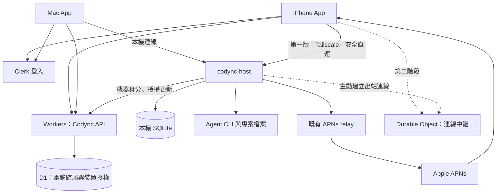

# Codync 帳號、裝置管理與 Cloudflare 架構計畫

日期：2026-09-25  
狀態：規劃文件；尚未實作或部署。文中的時間、容量與保留期限是建議產品設定，不是服務商限制。

## 1. 目標與核心決策

讓使用者在 Mac 和 iPhone 登入同一個 Codync 帳號後，能找到自己的電腦、完成首次授權、管理已授權裝置，並在之後擴充訂閱與免 Tailscale 的遠端連線。

採用以下分工：

- **Clerk**：使用者身分、Google 等登入方式與登入 session。
- **Cloudflare Workers + D1**：帳號與電腦的歸屬、裝置授權、撤權、必要的管理資料。
- **電腦上的 codync-host + SQLite**：bots、threads、entries、專案設定、agent 執行與實際操作權限。
- **既有 Cloudflare 推播 relay**：APNs 通知與 Live Activities，逐步補上帳號與裝置授權。
- **後續 Durable Objects + WebSocket**：協調及中繼手機與 host 的連線。

第一版先完成帳號與裝置管理，直連仍使用 Tailscale／受保護的本機網路連線。聊天、程式碼與本機 SQLite 不會整份複製到 D1。

保留不登入的本機模式。登入是使用雲端管理功能的必要條件，不是本機 agent 執行的必要條件。

### 1.1 Bot、computer、帳號與連線方式（新增需求）

每個 bot 固定屬於一台 computer；該 computer 是 agent、專案目錄、session 與聊天資料實際所在的位置。Mac App 是操作介面，不代表 bot 必須在目前這台 Mac 執行。

- 一個 bot 只能對應一台 computer；預設允許同一台 computer 執行多個 bots，不強加「一台只能有一個 bot」的限制。
- computer 可以是本機 Mac、另一台已配對的電腦，或經 SSH 連到的遠端 Mac／Linux。
- SSH 是連線方式；它不取代 computer 的穩定身分，也不是 agent 類型。
- Codync 帳號管理 computer 與 bot 的可見範圍；SSH 的 `user@machine` 是執行／連線身分；Claude／Codex 帳號則是 agent 自身的登入，三者不得混用同一個 account 欄位。
- 手機左上角目標改成「帳號切換」，不再以切換目前 computer 作為整個 bot 清單的主入口。已確認此處指不同 Google／Clerk 的 Codync 登入帳號，各自管理電腦與 bots。
- computer 選擇放在新增 bot 流程與 bot 設定；bot 清單、聊天標頭顯示所屬 computer，讓使用者知道命令會在哪裡執行。

目標階層為 `Account → Computers → Bots`，帳號下的 bot 清單可跨 computer 彙整。使用者可以同時保有本機 bot 與遠端 bot，不需要每次先切換全域 host。

具體的多 computer 路由與 SSH 計畫見 [Bot 與遠端 computer 計畫](bot-computer-ssh-plan.md)。

## 2. 已確認的專案現況

| 現況 | 程式位置 | 對計畫的影響 |
|---|---|---|
| Mac 已使用 ClerkKit，支援 Google 登入 | `apps/shared/AccountSession.swift`、`docs/clerk-macos.md` | 延伸現有登入，不另建帳號系統 |
| iOS 尚未接 Clerk，以掃碼配對進入主畫面 | `apps/ios/App/CodyncApp.swift`、`apps/ios/Views/RootView.swift`、`PairingView.swift` | 新增可略過的登入入口與雲端電腦清單 |
| host SQLite 位於 `~/.codync/codync.db` | `host/src/main.rs`、`host/src/store.rs` | 保留本機資料與既有 `rev` 同步機制 |
| host 使用共用 pairing token，旋轉會使所有舊裝置失效 | `host/src/main.rs`、`host/src/api.rs` | 必須新增逐裝置授權，才能精準撤權 |
| 手機配對資料序列化到 App Group UserDefaults | `kit/Sources/CodyncKit/Client/SharedStore.swift` | 秘密搬到 Keychain，UserDefaults 僅留顯示資料與參照 |
| 命令走 HTTP API，事件走 SSE | `host/src/api.rs`、`kit/Sources/CodyncKit/Client/HostClient.swift` | 第一版沿用；後續用 transport 抽象接中繼 |
| 已有 Cloudflare Worker 轉送 APNs，使用加密 ticket | `relay/src/index.ts`、`relay/wrangler.toml` | 保留相容性；它目前不是裝置目錄或聊天中繼 |
| Remote screen 使用獨立 helper 與 WebRTC | `apps/screen/`、`kit/Sources/CodyncUI/Screen/` | 影像傳輸與聊天中繼分開 |

目前「Mac 登入成功」不等於「手機已獲准連 host」。現有配對 token 也不會因 Clerk 登出而自動失效。

## 3. 本機 SQLite 與雲端 D1 的資料邊界

SQLite 是資料庫引擎；本機 SQLite 存在使用者電腦，D1 的資料存在 Cloudflare。兩者不會自動互相同步，也不是彼此的完整備份。

| 資料 | 權威來源 | 雲端是否保存 |
|---|---|---|
| 使用者登入身分、登入方式 | Clerk | Clerk 保存；D1 只保留關聯 ID 與必要狀態 |
| 電腦歸屬、裝置授權與撤權版本 | D1 | 是 |
| 電腦顯示名稱、版本、最後回報時間 | D1 中的 host 回報 | 是；線上狀態只是估計 |
| bots、threads、聊天、工具輸出與 agent session | host SQLite | 第一版不保存 |
| 專案檔案、路徑、agent API keys、MCP 憑證 | 使用者電腦 | 不保存 |
| 連線候選位址 | host | 第一版由配對／本機探索取得；不建立含私人 IP 的全域目錄 |
| 裝置私鑰、存取憑證 | 各裝置的安全儲存 | 私鑰不上傳；雲端可存公鑰或憑證雜湊 |
| APNs token／ticket | 手機與推播服務 | 維持必要的加密處理；不寫入一般 log |
| 訂閱權益 | 後續付款供應商事件與後端計算結果 | 商業化階段才新增 |

雲端目錄的價值：新手機即使還沒連到 Mac，也能知道帳號擁有哪些電腦，並啟動授權流程。電腦離線時仍能顯示清單，但無法讀取最新 bots、聊天或執行新指令。

既有推播內容可能經 Cloudflare 與 Apple 處理；未來聊天中繼也會處理傳輸內容。「不持久化聊天」不等於「內容從不經過雲端」，也不等於端對端加密。

## 4. 服務配置與範圍

| 服務 | 用途 | 導入階段 |
|---|---|---|
| Clerk | 原生登入、session、身分驗證 | 第一版 |
| Workers，新增 `codync-api` | 帳號 API、claim、授權、撤權、webhook | 第一版 |
| D1 | 管理資料與事件去重 | 第一版 |
| 現有 `codync-relay` Worker | APNs 與 Live Activities | 延用並升級 |
| Durable Objects | 每台 host 的連線協調、WebSocket 中繼、即時撤權通知 | 第二階段 |
| R2 | 使用者明確選擇的附件／備份 | 有實際需求再導入 |
| Queues | 推播與 webhook 的背景處理、重試 | 量體或可靠性需要時導入 |
| Workers KV | 非關鍵設定快取 | 非必要；不作為授權與撤權權威來源 |
| TURN 服務 | WebRTC 無法直連時的媒體轉送 | 遠端畫面階段另行評估 |

先新增 `cloud/` 放帳號與裝置 API，保留 `relay/` 的部署與 API，避免一開始就改壞既有推播。Workers 是雲端後端的執行位置，不需要另租常駐 VM。

Cloudflare Tunnel 不列為第一版終端使用者的安裝依賴。帳號驗證、host 授權與跨網路傳輸是不同問題，不能靠加一個 Tunnel 就視為全部完成。

## 5. 架構

雲端不執行 agent，不遠端修改使用者專案。所有命令最終仍由 host 驗證與執行；不能因為流量經中繼就繞過 host 的權限檢查。

## 6. 使用者流程

### 6.1 Mac 首次綁定

1. 使用者透過現有 Clerk 流程登入。
2. App 顯示「將這台電腦加入我的帳號」，明確展示目標帳號。
3. App 向雲端取得有效期建議 5 分鐘的一次性 claim challenge。
4. App 透過已驗證的本機連線，請 host 產生／使用機器金鑰簽署 challenge。
5. 雲端驗證 Clerk session、challenge、host 持有金鑰的證明與 claim 狀態，原子化建立 ownership。
6. host 保存 cloud host ID、owner ID、機器憑證與授權版本；開始低頻回報狀態。

claim 必須綁定使用者、host 公鑰、nonce 與到期時間；只傳 `hostId`、email 或任意公鑰不能取得既有電腦的所有權。同一個已 claim 的 host 不能被另一個帳號覆蓋。

第一次信任建立依靠本機 App／host 連線與使用者確認，不從未驗證的網路 `/health` 回應直接信任 host 身分。Linux 後續提供一次性瀏覽器 claim code 的等效流程，不儲存使用者 Clerk refresh credential 到 daemon。

### 6.2 iPhone 登入與連接

1. iPhone 使用與 Mac 相同環境的 Clerk instance 登入；使用 iOS 自己的 bundle ID 與 callback 設定。
2. `GET /v1/hosts` 取得自己的電腦清單，顯示離線／最後回報時間。
3. 使用者選擇電腦，新手機提出裝置授權申請。
4. Mac 顯示手機名稱、帳號與申請時間，由使用者確認。
5. 手機獲得綁定該 host 的短效 grant，並完成安全直連設定。
6. 手機向 host 取得 bots 與歷史訊息。

第一版新手機仍可能需要一次掃碼來交換連線資訊與驗證 host。登入取得裝置清單，不代表已解決 NAT、IP 探索或 Tailscale 安裝。UI 必須分別顯示「已綁定帳號」「已授權」「可連線」。

### 6.3 裝置管理與帳號切換

- 「我的電腦」：列出、改顯示名稱、查看最後連線、解除雲端綁定。
- 「已授權裝置」：查看每支手機的授權狀態、撤銷單一裝置。
- 新裝置申請有效期建議 10 分鐘，過期要重申請，不能留成無限期待批准。
- 手機登出／換帳號：關閉帳號連線，刪除該帳號 grant 與本機快取，清除相關 widget snapshot；不得顯示上一個帳號的 bots。
- 手機登出盡力撤銷該裝置在雲端的 session／grant；若離線登出，先清本機資料，剩餘權限受 lease 到期限制。
- Mac App 登出只結束互動式登入；daemon 的雲端綁定持續存在，UI 要提示如何另行解除綁定。
- 解除 host 綁定撤銷全部帳號型 grant 與機器憑證，不刪本機專案、bots 或聊天。
- 帳號刪除要同步處理 host ownership、裝置、推播訂閱、雲端 metadata 與後续商業資料保留要求。

## 7. 驗證、授權與撤權模型

### 7.1 三種身分分開

| 身分 | 驗證方式 | 可做的事 |
|---|---|---|
| 使用者 App | Clerk session token | 存取自己的管理資源、提出授權 |
| host daemon | 專用機器金鑰／機器憑證 | 回報自身狀態、取得自身待辦授權、確認請求 |
| 已授權手機到 host | 短效 host grant + 裝置持有金鑰證明 | 執行 grant 允許的 host 操作 |

Worker 驗證 Clerk token 的簽章、issuer、到期與適用的 audience／authorized-party 設定，從已驗證的 `sub` 取得 user ID。依實際 Clerk token 格式核對 claims，不能假設所有 token 都含同一組欄位。

每次查詢、更新都帶 owner 範圍並檢查帳號／host／grant 是否仍有效。不信任 client body 裡的 owner ID；知道另一個 host ID 不構成權限。JWT 驗證使用維護中的函式庫，快取 JWKS 並支援 key rotation。

### 7.2 新的 host grant

建議包含：`grantId`、`hostId`、`deviceId`、`userId`、`scopes`、`authVersion`、`iat`、`exp`、裝置公鑰指紋。雲端以獨立 signing key 簽署；host 信任已配置的 issuer 與 key set。

- scopes 至少區分讀取、送訊息、bot 設定、permission 回覆與 screen control。
- 裝置金鑰證明須使用標準簽章機制、一次性 challenge／防重播狀態；不自創加密協定。
- cloud host ID 由雲端分配；原本本機 host ID 留作關聯。複製資料庫造成相同 local ID 時，不能自動視為同一台可信電腦。
- host 擁有的機器憑證不能批准另一台 host 的請求；新裝置批准必須對應實際本機確認事件。
- Remote screen 的 OS 權限與 `setScreenEnabled` 本機限制繼續由 host／helper 執行，grant 不能越過它們。

### 7.3 明確的撤權時效

第一版採短 lease，建議 grant 最長 15 分鐘。host 有網路時每 30 秒檢查授權版本，目標在 60 秒內中止被撤權連線；第二階段改為中繼即時通知並保留輪詢／到期後備機制。

雲端不可達時，不允許無限延長帳號型遠端存取。lease 到期後停止該裝置的讀寫與 screen control，即使 SSE／WebSocket 已建立也要檢查到期並關閉。host 上原有本機任務可繼續執行。

撤權不等於撤回已下載資料，也不保證取消已開始的 agent 工作。產品先定義為阻止後續存取；使用者如需停止工作，應另送 stop。screen control 連線撤權後要立即交還本機控制。

本機獨立配對是另一種權限來源。若仍存在舊共用 token，雲端撤權無法使它失效；遷移前不能宣稱「已撤銷此手機的所有存取」。

### 7.4 秘密與傳輸

- Clerk publishable key 可存在 App；Clerk secret、APNs key、雲端簽章私鑰只放 Worker secrets。
- iOS／macOS 的裝置私鑰與 grant 放 Keychain；widget 使用必要的 Keychain access group，不將 token 放 App Group UserDefaults。
- host 私鑰使用 OS 安全儲存或受限制權限的檔案；Linux 至少使用專屬使用者與 `0600`。
- 第一版優先 Tailscale 的加密連線；一般 LAN 需有已驗證的 TLS／配對信任機制才啟用新帳號型遠端權限，不能直接把長效 token 暴露在普通 HTTP。
- 不在 URL query、一般 log、分析事件或 crash report 中記錄憑證。現有 query token 相容入口需列入退場範圍。
- 若未來需要中繼無法讀取內容，另做端對端加密設計與審查，不能把 TLS 描述成端對端加密。

## 8. D1 資料模型

以下為 migration 設計依據；實作時提供真正 SQL、索引、約束與遷移測試。

| Table | 主要欄位 | 約束／索引 |
|---|---|---|
| `accounts` | `clerk_user_id`, `status`, `created_at`, `deleted_at` | Clerk ID 為主鍵；不以 email 作關聯 |
| `hosts` | `id`, `owner_user_id`, `local_host_id`, `name`, `platform`, `version`, `status`, `last_seen_at`, `auth_version` | owner/status 索引；ownership 變更必須經受控流程 |
| `host_keys` | `id`, `host_id`, `public_key`, `fingerprint`, `created_at`, `revoked_at` | fingerprint 唯一；支援輪替 |
| `devices` | `id`, `owner_user_id`, `name`, `platform`, `public_key`, `revoked_at` | owner 索引；installation ID 不充當秘密 |
| `host_grants` | `id`, `host_id`, `device_id`, `scopes`, `status`, `approved_at`, `revoked_at`, `version` | host/device 唯一；驗證雙方 owner 一致 |
| `claim_challenges` | `id`, `user_id`, `nonce_hash`, `expires_at`, `consumed_at` | 一次性消耗；到期清理 |
| `access_requests` | `id`, `host_id`, `device_id`, `status`, `expires_at`, `decided_at` | host/status 索引；條件更新避免雙重批准 |
| `processed_events` | `provider`, `event_id`, `processed_at` | provider/event 唯一，供 webhook 去重 |
| `audit_events` | `id`, `actor_id`, `action`, `target_id`, `result`, `created_at` | owner/time 索引；不含聊天、token、私人路徑 |

推播升級時新增 `push_subscriptions`，關聯 device、host grant、ticket 版本與失效時間。訂閱功能開發時才新增 `entitlements` 與付款事件資料，不把付款狀態與 Google 登入混在一起。

所有時間統一 UTC。ID 不重用。重要變更用 D1 支援的原子操作／batch 與唯一約束，實作前核對交易語意；不得使用「先查不存在，再無條件新增」處理 claim。

D1 中授權寫入後的讀取必須提供所需一致性；若啟用 read replicas／Sessions，明確設計 read-after-write。撤權不能被一般快取或 replica 的舊值覆蓋。

## 9. API 契約草案

API 使用 `/v1`，錯誤固定為 `{ error: { code, message }, requestId }`。列表分頁，所有 mutation 定義重試與冪等語意。跨帳號資源回覆不洩漏其存在；細節只記安全稽核。

| Endpoint | 呼叫身分 | 行為 |
|---|---|---|
| `GET /v1/me` | Clerk | 取得／初始化最小帳號資料 |
| `POST /v1/devices` | Clerk + 裝置持有金鑰證明 | 註冊目前 installation |
| `GET /v1/devices` | Clerk | 列出自己的裝置 |
| `DELETE /v1/devices/:id` | Clerk | 撤銷該裝置全部帳號型 grant |
| `POST /v1/host-claims` | Clerk | 建立一次性 claim challenge |
| `POST /v1/host-claims/:id/complete` | Clerk + host 簽章 | 原子化認領 host |
| `GET /v1/hosts` | Clerk | 列出自己的電腦 |
| `PATCH /v1/hosts/:id` | Clerk owner | 修改雲端顯示名稱 |
| `DELETE /v1/hosts/:id` | Clerk owner | 解除綁定、撤銷 key/grant、增加授權版本 |
| `POST /v1/hosts/:id/access-requests` | Clerk + 裝置證明 | 申請首次連線授權 |
| `GET /v1/access-requests/:id` | 申請者或對應 host | 查申請結果 |
| `POST /v1/host/access-requests/:id/decision` | 對應 host | 傳回本機批准／拒絕 |
| `GET /v1/hosts/:id/grants` | Clerk owner | 列出已授權裝置 |
| `DELETE /v1/hosts/:id/grants/:grantId` | Clerk owner | 撤銷單一 grant |
| `POST /v1/hosts/:id/connection-grants` | Clerk + 裝置證明 | 核對有效批准後發短效 grant |
| `POST /v1/host/heartbeat` | host | 更新自身版本、最後回報時間 |
| `GET /v1/host/authorization-state` | host | 取得自身授權版本、撤權與待批准申請 |
| `POST /v1/webhooks/clerk` | 驗證 webhook 簽章 | 帳號刪除／停用，去重與同步撤權 |

機器請求包含 timestamp、nonce、method/path/body 的簽章或等效標準機器驗證，防止 heartbeat／approval 重播。heartbeat 不能更新 owner。

## 10. 既有使用者與資料遷移

1. 新版本先讀舊 `Pairing` 與電腦清單，不要求重建 bots 或清除 SQLite。
2. 把 pairing 秘密移到 Keychain；寫入並讀回成功後才刪除 UserDefaults 中的秘密。保留可重入的 migration version。
3. 舊掃碼配對標為「本機配對」；登入不會自動把全部舊 host 宣告為該帳號所有。
4. 使用者在實際電腦上完成 claim，再逐支手機升級到獨立 grant。
5. 新授權驗證成功後，明確提示舊共用 token 仍有效；提供在電腦上「停用舊配對」的收尾操作。
6. 保留本機 helpers 所需的驗證，但將其限制到本機用途；不繼續讓該憑證兼任所有手機的遠端管理權限。
7. 同一台電腦在雲端與舊配對清單中出現時，經驗證的 host 身分對應後合併顯示，不用名稱或 IP 去重。
8. 版本協商包含 auth/protocol capabilities；不相容時提示升級，不在失敗時靜默降級為共用 token。

## 11. 推播與離線行為

現有 APNs ticket 具備加密，但持有 ticket 即能向 relay 要求推播；目前 payload 沒有明確到期與帳號／host grant 歸屬。升級時新增版本、到期、授權關聯、撤銷查核與限流。

- host 只能通知自身有效 grant 對應的手機；不能自行提交任意帳號裝置。
- 登出、撤權與 APNs `Unregistered` 都要清理或停用 subscription。
- 推播是提醒，不是授權憑證；點擊後重新驗證，再從 host 取得內容。
- 保留舊 ticket 過渡期，明確設定停止接受日期／版本門檻，避免永久留下繞過撤權的入口。
- 預設通知採最少內容；是否顯示訊息摘要提供使用者設定。

| 情境 | 預期行為 |
|---|---|
| 電腦離線／睡眠 | 顯示最後回報；不假裝已送達命令，也不把 heartbeat 當連線保證 |
| 雲端暫時故障 | 本機 agent 繼續；既有帳號型直連僅在有效 lease 內使用 |
| Clerk 暫時不可用 | 已驗證且未過期的 session 可依快取公鑰驗證；需要刷新時顯示可重試狀態 |
| 手機切換網路 | 重新驗證連線，沿用 host `rev` 補事件；送訊息用既有 nonce 去重 |
| 撤權時有正在執行的工作 | 阻止後續存取；工作是否停止由獨立 stop／本機控制決定 |

第一版不在雲端替離線 host 排隊執行命令。手機保留未送出內容時，要清楚標示，恢復後依冪等鍵送出；permission 回覆等時效性操作不得盲目重播。

## 12. 第二階段：免 Tailscale 的遠端連線

目標是 host 主動建立出站連線，手機不需知道私人 IP 或設定路由器。

1. 每台 host 對應一個 Durable Object，host 與手機分別完成身分與 grant 驗證。
2. 定義版本化 envelope：`requestId`、`hostId`、`deviceId`、`method`、`payload`、`deadline`、protocol version。
3. Worker／DO 做路由與連線管理，host 再驗證操作權限；不提供任意 URL 代理或任意 TCP 轉送。
4. 保留 `clientNonce`、`rev` 與去重；斷線後從 host 補齊事件，不靠 DO 保存完整聊天。
5. 設定每帳號／host 的連線數、訊息大小、in-flight requests、backpressure、逾時與頻寬預算。
6. Durable Object 重啟／休眠不能遺失必要的認證上下文；重連需重新驗證，未完成 mutation 回報結果未知並透過 ID 查詢。
7. 先支援聊天／狀態，再加入 terminal streaming；screen signaling 與影像傳輸分別驗收。

WebRTC 優先直連，必要時使用 TURN；憑證需短效且受裝置授權約束。Cloudflare 是否承接 TURN、其容量和費用，在該階段核對官方文件後決定。

只做傳輸層 TLS 的中繼可接觸明文。若選擇端對端加密，需要另外定義首次信任、換機、key rotation、撤權與復原，不在本計畫第一版順帶承諾。

## 13. 儲存庫實作位置

| 位置 | 預計修改 |
|---|---|
| `cloud/`（新增） | Workers API、D1 migrations、驗證／授權模組、API 測試、Wrangler 設定 |
| `relay/` | ticket 升級、subscription 驗證、限流與相容遷移 |
| `apps/shared/AccountSession.swift`（已提取共用） | 從 Mac 提取兩端共用 Clerk wrapper，以 target sources 引入 |
| `apps/ios/App/`、`apps/macos/App/` | App lifecycle、登入、登出清理、各平台 callback |
| `apps/ios/Views/`、`apps/macos/Views/` | 登入入口、我的電腦、授權申請與撤權 |
| `kit/Sources/CodyncKit/Client/` | `CloudClient`、Keychain 儲存、配對遷移；不引入 Clerk 到 widget-safe core |
| `kit/Sources/CodyncUI/Store/` | 本機／雲端電腦清單合併、帳號切換、grant 更新 |
| `host/src/` | host identity、cloud client、逐裝置 auth、撤權與版本協商 |
| `project.yml` | iOS Clerk 依賴、shared sources、config 與 Keychain entitlement 配置 |
| `docs/clerk-macos.md`、README、PairingView 文案 | 更新帳號、資料處理與本機模式說明 |

實作應保持帳號 SDK 與 widget-safe 資料模型分離，避免 widget 因共享套件被迫初始化 Clerk。不要把雲端管理 API 全塞進現有 `HostClient`。

## 14. 分階段交付與完成條件

### P0：確認邊界與協定

- 確認本機模式保留、第一版仍可能掃碼／使用 Tailscale、首次手機需要 Mac 確認。
- 完成 claim、grant、傳輸安全、撤權 lease 與 host identity 的協定細節。
- 核對 Clerk 原生 iOS 配置、Cloudflare D1 一致性與 migration 能力。
- 核對 iOS 上架所需的登入選項、帳號刪除流程；若需 Apple 登入則列入 P1。
- 決定 staging／production 環境、API domain、秘密輪替與資料保存政策。

完成條件：沒有「雲端已撤權但有效連線可無限使用」或「知道 host ID 就能認領」的空白設計。

### P1：兩端帳號與唯讀裝置目錄

- 新增 `cloud/`、D1 migrations、JWT 驗證、`me`、host claim/list 與最小 audit。
- iOS 加入 Clerk；共用 AccountSession；登入可略過。
- Mac 明確 claim，host 以機器身分 heartbeat；iPhone 顯示我的電腦。
- 已列出但未授權的電腦顯示後續設定提示，不能點一下就繞過配對。

完成條件：同帳號兩端清單一致；不同帳號完全隔離；既有掃碼配對與本機資料仍可用。

### P2：逐裝置授權、撤權與遷移（第一版正式目標）

- 完成 devices、access requests、grants、host 認證與 scopes。
- 完成安全直連、Keychain migration、登出／帳號切換清理。
- 實作在線撤權與離線 lease 到期；存量連線也要停止。
- APNs ticket／subscription 升級，補上單一裝置撤權與舊 token 退場。
- 完成帳號刪除 webhook、冪等重試與所有失敗提示。

完成條件：撤銷手機 A 後，A 在約定時限內失去存取，手機 B 正常；雲端失聯時 A 也不能超過 lease 繼續使用。

### P3：免 Tailscale 中繼

- 加入 Durable Objects、host 出站連線、transport 抽象與版本化訊息。
- 驗證斷線重連、去重、事件補齊、限流與中繼重啟。
- 先推出聊天，再逐項驗收 terminal、screen signaling 與 TURN。

完成條件：手機行動網路連家中 NAT 後的 host，不需要開 port；權限與撤權行為與直連一致。

### 可提前導入：多 computer bot 路由與 SSH 試行

- P1／P2 的資料模型一併納入每 bot 的 computer 關聯、帳號作用域與複合路由 ID，避免日後重做 cache、deep link 與通知格式。
- 先實作帳號內多 computer 的 bot 彙整與路由；每台 computer 保有自己的 `BotStore`／同步游標，不把多個 host 的 `rev` 混成一個。
- SSH 試行使用 macOS 系統 OpenSSH，連到遠端已安裝的 codync-host，透過 loopback tunnel 重用既有 API；不先實作任意 SSH command 當完整 bot backend。
- SSH 試行不依賴雲端中繼，可以在 P2 後、P3 前交付；但必須先完成 host 身分驗證、獨立授權、連線生命週期及正確路由。
- 手機直接連 SSH host、手機經 Mac gateway 存取，以及免安裝 remote host 是不同工作項；不因桌面 tunnel 成功就宣稱三者均完成。

完成條件與延後原因詳見 [SSH 計畫的整合門檻](bot-computer-ssh-plan.md#6-整合順序與是否現在一起做)。

### P4：商業與可選同步

- 依實際需求接訂閱／權益、驗證付款 webhook、提供基本使用者支援後台。
- 評估 R2 備份／附件與 Queues；用戶選擇上傳後才建立對應資料生命週期。
- 平台管理員可管理帳號狀態與權益，但不因此獲得讀取本機專案／聊天的權限。

此階段另立付款與資料同步計畫，不把登入系統當作已完成訂閱後端。

## 15. 驗證矩陣

| 類別 | 必測案例 |
|---|---|
| 身分 | 過期／錯 issuer／偽造 JWT、取消登入、session 恢復、key rotation |
| 租戶隔離 | 帳號 A 猜到 B 的 host/device/request/grant ID 仍無法讀寫；列表不洩漏 |
| Claim | 過期、重播、兩帳號競爭、複製 local host ID、重複提交、host key 不匹配 |
| 授權 | 首次批准／拒絕／逾期、scope 不足、裝置持有證明錯誤、grant 跨 host 使用 |
| 撤權 | SSE／WebSocket 存量連線、雲端失聯 lease 到期、screen control、舊 token 仍在 |
| 遷移 | 舊手機升級、寫 Keychain 失敗、重複跑 migration、多台電腦、帳號切換、widget |
| 推播 | 已登出／撤權不再通知、ticket 過期、APNs token 更新與 `Unregistered` |
| 網路 | LAN、Tailscale、行動網路、Mac 睡眠、host 重啟、雲端 outage、網路切換 |
| 冪等 | 重複 claim/approve/webhook/send、API response 丟失後重試不重複執行 |
| 刪帳號 | 重複／亂序 webhook、禁止重新發 grant、撤權、metadata 清理與最小 tombstone |
| 本機能力 | 未登入仍可本機執行；雲端故障不破壞本機 SQLite／現有工作 |

Worker 執行 typecheck 與具 D1 binding 的整合測試；Rust 執行 auth／遷移測試；Swift 執行登入狀態、Keychain 與帳號切換測試。最後使用兩個測試帳號、兩台手機／模擬器與實際 Mac 驗證，不以編譯成功代替 OAuth／跨裝置驗收。

## 16. 部署、監控、成本與回滾

- local、staging、production 使用不同 Clerk instance／D1／Worker secrets；release 不含測試 key 或 staging API URL。
- 部署順序：相容的雲端 API → 新 host → 新手機 → 關閉舊配對／ticket 路徑。每步設定最低協定版本與遙測指標。
- D1 schema 使用先擴充再移除；migration 前做可還原備份並演練還原。回滾不能把已撤銷 grant 恢復為有效。
- 初期採帳號 allowlist 與功能旗標。關閉雲端功能時保留本機工作能力，但不得靜默恢復舊的不安全遠端權限。
- 監控 API 錯誤率／延遲、claim 成功率、撤權延遲、heartbeat、連線數、推播失敗、D1 讀寫量；log 做秘密過濾。
- audit events 建議保留 30 天；過期 challenge／request 定期清理。刪帳號後的最低限度 tombstone、備份保留與清除期限在正式隱私政策中定義。
- 第一版 heartbeat 建議 60 秒一次、降低 D1 寫入頻率至約 5 分鐘一次；authorization polling 30 秒一次。100 台常在線 host 的 30 秒輪詢約為每日 288,000 次，需納入預算。
- 明確區分 Workers requests、D1 rows read/written、DO 活躍時間／訊息、log、推播及未來 TURN 頻寬；不預設免費額度一定夠。
- 若輪詢成本過高，提早導入 DO 連線通知屬里程碑調整；不要為省成本把撤權查核改成無期限快取。
- 設定每帳號裝置數／申請頻率／claim 次數與預算告警；具體商業上限待量測後確定。

## 17. 尚待確認的產品選項

本計畫已選可實作的預設，不因這些選項未定而阻止 P0／P1 準備。

| 選項 | 預設建議 | 何時必須定案 |
|---|---|---|
| 是否強制登入 | 本機模式可略過；雲端管理需要登入 | P1 UI |
| 新手機能否自動授權 | 需要 Mac 確認 | P2 |
| 雲端失聯可用多久 | 帳號型 grant 最長 15 分鐘；本機使用不受影響 | P2 |
| 重新登入是否恢復舊批准 | 同一 installation 金鑰可重新驗證；已撤銷裝置需重新批准 | P2 |
| 是否雲端保存聊天 | 第一版不保存 | 若進 P4 同步 |
| 中繼是否端對端加密 | 未承諾；單獨設計 | P3 前 |
| 付款方式／方案 | 尚未選定 | P4 前 |
| 團隊共享／多 owner | 第一版不做；每台 host 一個 owner | 後續獨立需求 |

## 18. 參考資料與核對狀態

本文件的現況已對照儲存庫。撰寫時網頁工具回傳驗證錯誤，先前直接存取官方網站也受到限制，因此不把最新價格、配額或上架規則寫成已驗證事實。以下官方入口供各里程碑實作前核對：

- [Clerk iOS Quickstart](https://clerk.com/docs/ios/getting-started/quickstart)
- [Clerk Session Tokens](https://clerk.com/docs/guides/sessions/session-tokens)
- [Clerk JWT Verification](https://clerk.com/docs/guides/sessions/manual-jwt-verification)
- [Cloudflare Workers](https://developers.cloudflare.com/workers/)
- [Cloudflare D1](https://developers.cloudflare.com/d1/)
- [Durable Objects WebSockets](https://developers.cloudflare.com/durable-objects/best-practices/websockets/)
- [Cloudflare R2](https://developers.cloudflare.com/r2/)
- [Cloudflare Queues](https://developers.cloudflare.com/queues/)
- [Apple App Review Guidelines](https://developer.apple.com/app-store/review/guidelines/)

本地參考：[專案結構](structure.md)、[目前 macOS Clerk 設定](clerk-macos.md)、[既有推播 relay](../relay/README.md)。
